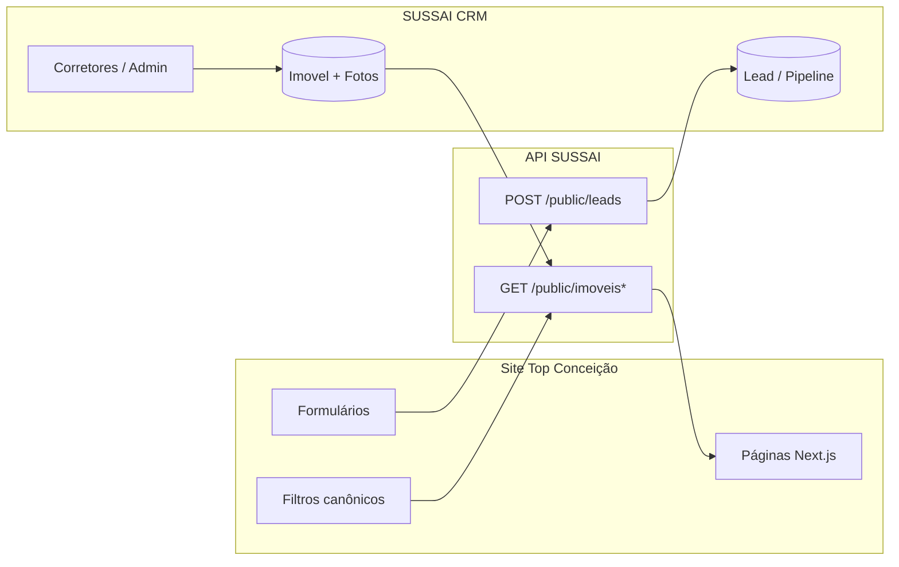
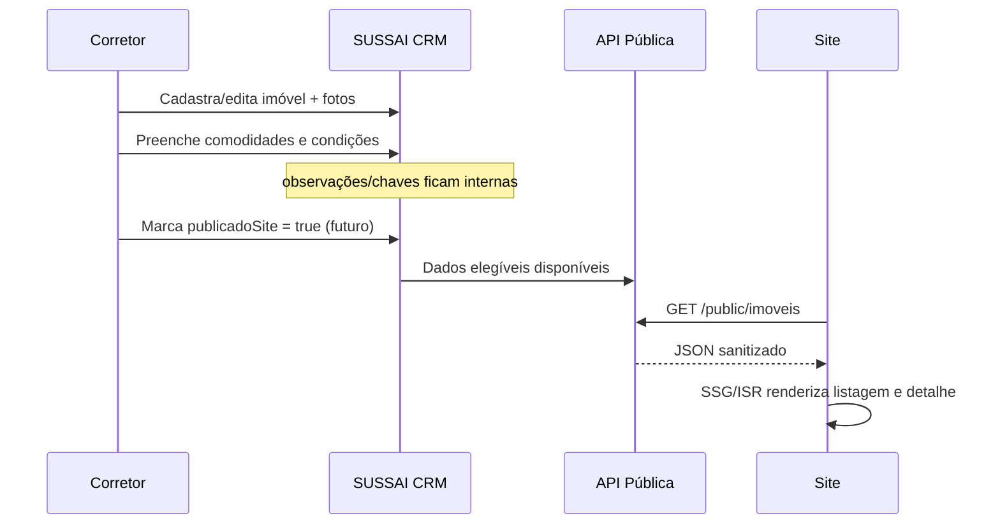
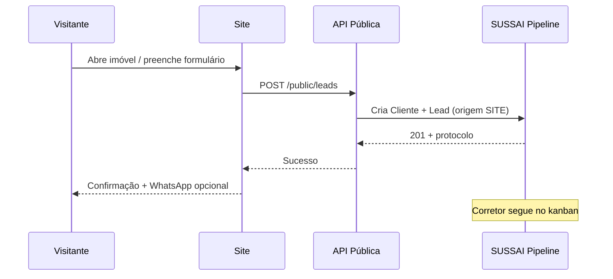

# Top Conceição Imóveis — Master Plan do Site

**Data:** 16/Jul/2026  
**Status:** Documentação de arquitetura (sem implementação de código)  
**CRM origem:** SUSSAI CRM (multi-tenant)  
**Cliente site:** Top Conceição Imóveis  
**Regra:** este documento define a arquitetura; a implementação do site aguarda sprint dedicada.

---

## 1. Visão do produto

Site institucional + catálogo de imóveis da **Top Conceição Imóveis**, alimentado pelo **SUSSAI CRM**.

Objetivos:

1. Gerar leads qualificados (compra, locação, venda, avaliação).
2. Exibir portfólio publicado a partir do CRM, com filtros alinhados ao catálogo canônico.
3. Transmitir confiança, autoridade local e conversão (WhatsApp + formulários).
4. Manter SEO técnico sólido (SSR/SSG híbrido, metadados, sitemap, Core Web Vitals).

Princípio de integração:

> O CRM é a **fonte da verdade** dos imóveis. O site é a **vitrine pública** + captura de leads.

---

## 2. Sitemap

```text
/
├── /                          Home
├── /imoveis                   Listagem (busca + filtros)
├── /imoveis/[slug]            Detalhe do imóvel
├── /comprar                   Atalho finalidade=VENDA
├── /alugar                    Atalho finalidade=LOCACAO
├── /lancamentos               Destaques / exclusividades (opcional v1.1)
├── /sobre                     Institucional
├── /equipe                    Corretores públicos (opcional)
├── /anuncie                   Captação de proprietários
├── /contato                   Contato geral
├── /favoritos                 Lista local (localStorage) — opcional v1
├── /politica-de-privacidade
├── /termos-de-uso
└── /sitemap.xml + /robots.txt
```

### Rotas administrativas (fora do site público)

| Área | Local |
|------|--------|
| Cadastro / edição de imóveis | SUSSAI CRM `/imoveis` |
| Publicação no site | Flag futura `publicadoSite` no CRM (ver §7) |
| Leads capturados | SUSSAI CRM Pipeline + origem `SITE` |

---

## 3. Arquitetura

### 3.1 Stack recomendada

| Camada | Tecnologia sugerida | Motivo |
|--------|---------------------|--------|
| Frontend site | Next.js (App Router) + TypeScript | SSR/SSG, SEO, performance |
| UI | Design system próprio da Top Conceição (não reutilizar DS interno do CRM) | Branding imobiliária ≠ SaaS |
| Estilo | CSS Modules / Tailwind (decidir na sprint de implementação) | Consistência e velocidade |
| Hospedagem | Vercel / Cloudflare Pages / VPS | CDN + preview |
| API | SUSSAI Backend (rotas públicas read-only + lead intake) | Uma única fonte de dados |
| Imagens | CDN / storage já usado pelo CRM + transformações (resize/WebP) | Performance |
| Analytics | GA4 + Meta Pixel (opcional) + eventos de lead | Funil comercial |
| Mensageria | WhatsApp Business click-to-chat | Conversão rápida |

### 3.2 Diagrama lógico



### 3.3 Ambientes

| Ambiente | Uso |
|----------|-----|
| `local` | Dev do site apontando para API local |
| `staging` | Preview com empresa Top Conceição (dados reais ou demo) |
| `production` | Domínio oficial da imobiliária |

Variáveis essenciais (site):

- `NEXT_PUBLIC_SITE_URL`
- `NEXT_PUBLIC_CRM_API_URL`
- `NEXT_PUBLIC_EMPRESA_SLUG` ou `EMPRESA_ID` (tenant Top Conceição)
- `NEXT_PUBLIC_WHATSAPP`
- `CRM_PUBLIC_API_KEY` (se autenticação de API pública for por chave)

---

## 4. Páginas

| Página | Objetivo | Dados principais | CTA |
|--------|----------|------------------|-----|
| Home | Hero + busca + destaques + confiança | Imóveis publicados, bairros, stats | Buscar / WhatsApp |
| Listagem `/imoveis` | Catálogo filtrável | Lista paginada + facets | Ver detalhe / Contato |
| Detalhe | Conversão no imóvel | Fotos, specs, mapa, corretor | Tenho interesse / WhatsApp |
| Comprar / Alugar | Landing de intenção | Mesma listagem com filtro pré-aplicado | Filtrar |
| Sobre | História e diferenciais | Conteúdo CMS estático | Contato |
| Equipe | Humanizar | Corretores com `publicadoSite` | WhatsApp do corretor |
| Anuncie | Captação de proprietários | Formulário específico | Enviar |
| Contato | Atendimento geral | Formulário + mapa + horários | Enviar / Ligar |
| Legal | Compliance LGPD | Textos estáticos | — |

---

## 5. Componentes (catálogo UI do site)

### 5.1 Layout

- `SiteHeader` / `SiteFooter`
- `MobileNav`
- `WhatsAppFloatingButton`
- `Breadcrumbs`

### 5.2 Busca e listagem

- `HeroSearch` (finalidade, cidade/bairro, tipo, valor)
- `PropertyFilters` (comodidades canônicas + exclusividade/financiamento/permuta)
- `PropertyGrid` / `PropertyCard`
- `PropertyPagination` / infinite scroll (decidir na implementação)
- `EmptyResults`
- `SortSelect`

### 5.3 Detalhe

- `PropertyGallery` (lightbox)
- `PropertySpecs` (quartos, suítes, áreas…)
- `PropertyAmenities` (chips do catálogo)
- `PropertyPrice`
- `PropertyMap` (opcional v1 — lat/lng futuro)
- `LeadForm` / `LeadDrawer`
- `BrokerCard`
- `ShareButtons`

### 5.4 Conversão e conteúdo

- `ContactForm`
- `OwnerCaptureForm` (anuncie)
- `TrustStrip` (CRECI, anos, imóveis)
- `NeighborhoodHighlights`
- `SeoHead` / JSON-LD helpers
- `CookieConsent` (LGPD)

---

## 6. Integrações com o CRM

### 6.1 Leitura de imóveis (pública)

Endpoints a criar em sprint futura do CRM (não nesta R1):

| Método | Rota sugerida | Uso |
|--------|---------------|-----|
| `GET` | `/public/imoveis` | Listagem paginada + filtros |
| `GET` | `/public/imoveis/:codigoOuSlug` | Detalhe |
| `GET` | `/public/imoveis/facets` | Contagens por bairro/tipo/comodidade |
| `GET` | `/public/opcoes` | Enums e `filtrosSite` |

Regras:

- Somente imóveis `ativo=true`, status elegível (`DISPONIVEL` / `RESERVADO` conforme política) e `publicadoSite=true` (flag futura).
- **Nunca** expor: `observacoesInternas`, `localChaves`, `codigoChave`, controle de retirada/devolução, dados bancários, documentos internos, telefones privados de proprietários.
- Fotos via URL assinada ou CDN pública.

### 6.2 Filtros alinhados (já preparados no CRM — Sprint R1)

Catálogo canônico `filtrosSite` / `FILTROS_CARACTERISTICAS_SITE`:

| Código | Label |
|--------|-------|
| `PISCINA` | Piscina |
| `EDICULA` | Edícula |
| `CHURRASQUEIRA` | Churrasqueira |
| `AREA_GOURMET` | Área Gourmet |
| `JARDIM` | Jardim |
| `CLOSET` | Closet |
| `ESCRITORIO` | Escritório |
| `LAVABO` | Lavabo |
| `MOBILIADO` | Mobiliado |
| `PLANEJADOS` | Planejados |
| `ACADEMIA` | Academia |
| `QUADRA` | Quadra |
| `SALAO_FESTAS` | Salão de festas |
| `ELEVADOR` | Elevador |
| `PORTARIA` | Portaria |
| `ENERGIA_SOLAR` | Energia Solar |

Filtros comerciais também preparados no CRM:

- `exclusividade`
- `aceitaFinanciamento`
- `aceitaPermuta`
- `ocupacao` (uso preferencial interno; site pode omitir ou mostrar “Desocupado”)

### 6.3 Escrita de leads

| Método | Rota sugerida | Payload mínimo |
|--------|---------------|----------------|
| `POST` | `/public/leads` | nome, telefone/whatsapp, email?, mensagem, imovelId?, finalidade?, origem=`SITE`, utm* |

Comportamento no CRM:

1. Criar/atualizar `Cliente` (tipo LEAD/COMPRADOR/INQUILINO).
2. Criar `Lead` no pipeline (etapa inicial).
3. Registrar interação/histórico.
4. Notificar corretor responsável (e-mail/WhatsApp interno — fase futura).

### 6.4 Auth da API pública

Opções (decidir na implementação):

1. API key por empresa + rate limit por IP.
2. Domínio allowlist + CORS estrito.
3. Combinação das duas.

---

## 7. Estrutura de banco utilizada

O site **não possui banco próprio** na v1. Consome o PostgreSQL do SUSSAI via API.

### 7.1 Modelos CRM relevantes

| Modelo | Uso no site |
|--------|-------------|
| `Empresa` | Tenant Top Conceição (nome, telefone, plano) |
| `Imovel` | Catálogo público (campos publicados) |
| `ImovelFoto` | Galeria |
| `Usuario` (corretor) | Card do corretor (se publicado) |
| `Cliente` + `Lead` | Destino dos formulários |
| `PipelineEtapa` | Etapa inicial do lead do site |

### 7.2 Campos `Imovel` — publicação vs interno

| Campo | Site | CRM |
|-------|------|-----|
| titulo, descricao, fotos, valores, endereço, dimensões | ✅ | ✅ |
| caracteristicas / comodidades | ✅ | ✅ |
| exclusividade, aceitaFinanciamento, aceitaPermuta | ✅ | ✅ |
| ocupacao | ⚠️ seletivo | ✅ |
| observacoesInternas | ❌ | ✅ |
| localChaves, codigoChave, chaveRetirada* | ❌ | ✅ |
| proprietario (PII) | ❌ | ✅ |

### 7.3 Campos futuros recomendados (antes ou junto da sprint do site)

| Campo | Tipo | Motivo |
|-------|------|--------|
| `publicadoSite` | Boolean | Controle editorial |
| `destaqueSite` | Boolean | Home / lançamentos |
| `slug` | String unique/empresa | URL amigável SEO |
| `publicadoEm` | DateTime | Ordenação / freshness |
| `metaTitle` / `metaDescription` | String? | SEO por imóvel |
| `latitude` / `longitude` | Float? | Mapa |

---

## 8. Fluxo de publicação de imóveis



Checklist editorial (operacional):

1. Fotos suficientes (mín. 5 sugerido).
2. Título e descrição públicos revisados.
3. Valores e finalidade corretos.
4. Características canônicas marcadas.
5. Status disponível/reservado.
6. Publicar no site.
7. Validar URL e preview SEO.

Despublicação:

- Soft delete / `ativo=false` ou `publicadoSite=false` → some da API pública na próxima revalidação (ISR).

---

## 9. Fluxo de leads



Canais de entrada:

1. Formulário no detalhe do imóvel.
2. Formulário de contato geral.
3. Formulário “Anuncie seu imóvel”.
4. Clique WhatsApp (UTM + código do imóvel na mensagem pré-preenchida).

Campos UTM a persistir (recomendado): `utm_source`, `utm_medium`, `utm_campaign`, `utm_content`, `gclid`.

---

## 10. SEO

### 10.1 Técnico

- HTML semântico, títulos H1 únicos, breadcrumbs.
- Meta title/description por página e por imóvel.
- Open Graph + Twitter Cards com foto principal.
- JSON-LD: `RealEstateListing` / `Apartment` / `House` + `Organization` + `BreadcrumbList`.
- `sitemap.xml` dinâmico (home, estáticas, imóveis publicados).
- `robots.txt` permitindo indexação das rotas públicas.
- Canonical URLs absolutas.
- Imagens com `alt`, dimensões e lazy-load (LCP da hero sem lazy).
- Core Web Vitals: LCP < 2.5s, CLS baixo, INP saudável.

### 10.2 Conteúdo

- URLs: `/imoveis/apartamento-3-dorms-vila-mariana-imv-001` (slug).
- Landing pages por bairro/tipo (fase 1.1).
- Blog/guias (fase 2 — opcional).

### 10.3 Local

- NAP consistente (nome, endereço, telefone) no footer e schema.
- Página Sobre com área de atuação (cidades/bairros).

---

## 11. Design e marca (diretrizes)

- Marca **Top Conceição Imóveis** como sinal dominante na home (não o nome SUSSAI).
- Tipografia expressiva própria da imobiliária (evitar stacks genéricas de SaaS).
- Hero full-bleed com fotografia real de portfólio/cidade.
- Evitar cards no hero; cards apenas na listagem/interação.
- CTA claros: Buscar, WhatsApp, Tenho interesse.
- Responsivo mobile-first (maioria do tráfego imobiliário).

---

## 12. Segurança, LGPD e performance

- Rate limit nos endpoints públicos.
- Honeypot / Turnstile nos formulários.
- Consentimento de cookies/analytics.
- Não indexar páginas de erro/teste.
- Cache CDN + ISR (revalidate on-demand quando imóvel muda).
- Logs sem PII sensível.

---

## 13. Roadmap de implementação (sprints futuras — não iniciar agora)

| Ordem | Entrega |
|-------|---------|
| S1 | API pública read-only + flags `publicadoSite`/`slug` |
| S2 | Site Next.js: Home + Listagem + Detalhe + Lead form |
| S3 | SEO avançado, mapa, equipe, anuncie |
| S4 | Analytics, A/B CTAs, landings de bairro |

**Fora desta fase:** não implementar código do site; apenas este plano.

---

## 14. Revisão automática da documentação

| Item | Status |
|------|--------|
| Sitemap completo | OK |
| Arquitetura e diagrama | OK |
| Catálogo de componentes | OK |
| Páginas e CTAs | OK |
| Integrações CRM (leitura + leads) | OK |
| SEO técnico e local | OK |
| Estrutura de banco / campos públicos vs internos | OK |
| Fluxo de publicação | OK |
| Fluxo de leads | OK |
| Alinhamento com filtros R1 do CRM | OK |
| Sem código de site nesta entrega | OK |

### Riscos / gaps a resolver na sprint do site

1. Flag `publicadoSite` e `slug` ainda não existem no schema (documentados como futuros).
2. Endpoints `/public/*` ainda não existem (apenas planejados).
3. Política de status `RESERVADO` no site precisa de decisão comercial.
4. Domínio, WhatsApp oficial e identidade visual final da Top Conceição devem ser confirmados antes do build.

---

## 15. Referências CRM

- Sprint R1 Imóveis: `docs/SPRINT_R1_REPORT.md`
- Catálogo frontend: `frontend/src/utils/imoveis.js` → `FILTROS_CARACTERISTICAS_SITE`
- API opções: `GET /imoveis/opcoes` → `filtrosSite`, `caracteristicas`, `ocupacoes`
